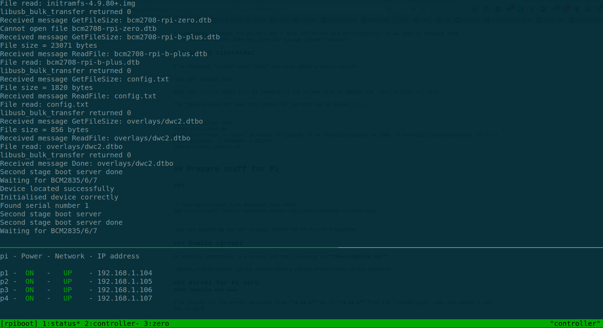
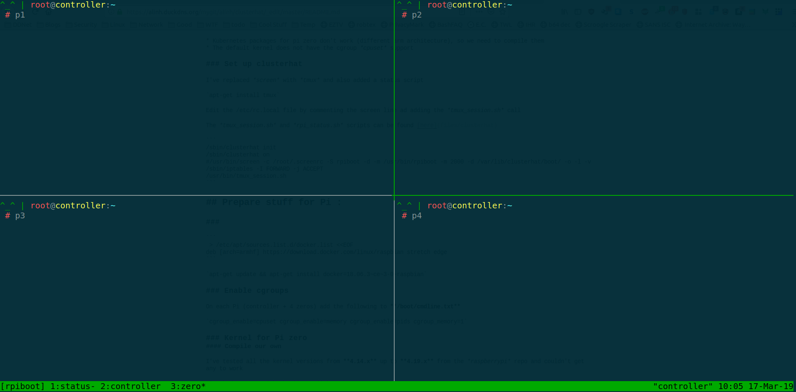

# Kubernetes the harder way on clusterhat
Thse are the steps needed to set up a Kubernetes cluster on [Clusterhat](https://clusterhat.com/). "The Cluster HAT (Hardware Attached on Top) which interfaces a (Controller) Raspberry Pi A+/B+/2/3 with 4 Raspberry Pi Zeros configured to use USB Gadget mode is an ideal tool for teaching, testing or simulating small scale clusters." from the Clusterhat website.

I've used the [rpiboot image](https://8086.support/content/23/88/en/guide-to-using-the-rpiboot-test-image-on-the-cluster-hat_zero-stem-or-just-a-usb-cable.html) (**ClusterHAT-2018-10-13-lite-1-usbboot.zip** at the time of this writing) which allows you to use the Pi zeros without sd card.

Setting up Kubernetes is largely based on Kelsey Hightower's [Kubernetes The Hard Way](https://github.com/kelseyhightower/kubernetes-the-hard-way).

### Important

Due to github's file size limit (and also to keep the transfers fast) I've gzipped most of the files
After cloning the repo you can run `find . -name *gz -exec gunzip {} +` in the `clusterhat-kubernetes` to get the uncompressed files back

### Problems

* Kubernetes packages for pi zero don't work (different arm architecture), so we need to compile them
* The default kernel does not have the cgroup *cpuset* support

### Set up clusterhat

I've replaced *screen* with *tmux* and also added a status script

`apt-get install tmux`

Edit the /etc/rc.local file by commenting the screen line ad adding the *tmux_session.sh* call

The *tmux_session.sh* and *rpi_status.sh* scripts can be found [here](files/clusterhat)

```
/sbin/clusterhat init
/sbin/clusterhat on
#/usr/bin/screen -c /root/.screenrc -S rpiboot -d -m /usr/bin/rpiboot -m 2000 -d /var/lib/clusterhat/boot/ -o -l -v
/sbin/iptables -I FORWARD -j ACCEPT
/usr/bin/tmux_session.sh
```

`/sbin/iptables -I FORWARD -j ACCEPT` is needed because as soon as you install docker, the world ends (not really, but you'll have problems with the pi zeros network connectivity)





## [Prepare stuff](docs/prepare.md)
## [Kubernetes the Hard Way](docs/kubernetes_the_hard_way.md)

If everything goes well you should now have a working Kubernetes cluster


```
# kubectl  get nodes

NAME         STATUS     ROLES    AGE    VERSION
controller   Ready      master   2d   v1.13.3
p1           Ready      <none>   2d   v1.13.3-dirty
p2           Ready      <none>   2d   v1.13.3-dirty
p3           Ready      <none>   2d   v1.13.3-dirty
p4           Ready      <none>   2d   v1.13.3-dirty
```

Test it

`kubectl run nginx --image=tobi312/rpi-nginx`

and scale it

`kubectl  scale deployments nginx --replicas=3`

It won't win any speed contests, but it works.

```
 # kubectl  get pods  -o wide
NAME                       READY   STATUS              RESTARTS   AGE   IP             NODE         NOMINATED NODE   READINESS GATES
coredns-75548f47f9-b8z5l   1/1     Running             1          11m   10.200.0.9     controller   <none>           <none>
nginx-7574679f4d-js4tk     1/1     Running             0          75s   10.200.2.140   p2           <none>           <none>
nginx-7574679f4d-vz44f     0/1     ContainerCreating   0          75s   <none>         p4           <none>           <none>
nginx-7574679f4d-z4vnq     1/1     Running             1          10m   10.200.0.11    controller   <none>           <none>
```
